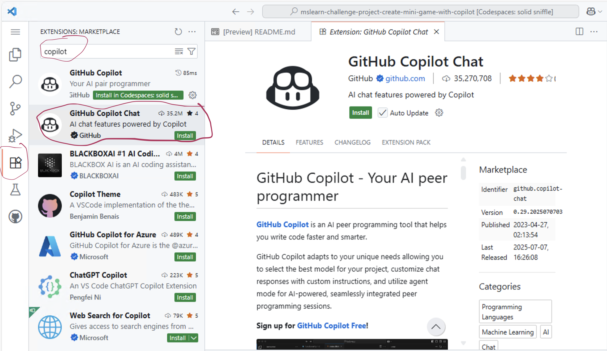
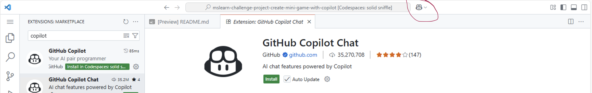

# 🎮 AI Game Designer Challenge: Rock Paper Scissors Ultimate Edition

## Overview
Welcome to your first game development studio! In this challenge, you'll work as a **game designer** with GitHub Copilot as your **AI coding partner**. You'll discover that modern programming is about creative collaboration with AI, not just writing code alone.

## Learning Objectives
- Experience programming as creative collaboration with AI
- Learn to communicate effectively with AI assistants
- Build confidence in problem-solving with technology
- Create a personalized, fun game that reflects your creativity
- Understand modern development practices used by professionals

## 🚀 Mission: Launch Your First Game Studio with AI

### Learn Module
1. **Follow the [Learn Module](https://learn.microsoft.com/en-us/training/modules/challenge-project-create-mini-game-with-copilot/?sharingId=F67AE3DA365A6582)** 
    - Complete the module until you reach: *"Visit the GitHub Copilot extension on the Visual Studio Marketplace and find the ID."*
    - This will prepare you with the foundational knowledge needed for this challenge





### 🎯 **Phase 1: Meet Your AI Development Team (5 minutes)**
**Learn to communicate with your AI partner**

1. **Open GitHub Copilot Chat** (Click copilot icon in the top bar or press `Ctrl+Alt+I` on Windows)




2. **Introduce yourself as a game designer:**

```
"Hi! I'm a new game designer and I want to create an awesome Rock Paper Scissors game. 
Can you be my coding partner and help me brainstorm ideas?"
```

3. **Ask for creative input:**
```
"What would make Rock Paper Scissors more exciting? 
Give me 3 fun variations we could build."
```

**🎉 What you'll learn**: AI can be creative, not just technical!

### 🎨 **Phase 2: Design Your Game Together (10 minutes)**
**Collaborative game design with AI**

**Ask Copilot Chat:**
```
"Let's design a Rock Paper Scissors game with these features:
- Fun emojis for choices 🪨📄✂️
- Exciting messages
- Score tracking
- Special victory celebrations
- Maybe a secret 'ultimate move'

Can you help me plan this step by step?"
```

**Then customize:**
```
"I want to add [your own creative idea]. How would we do that?"
```

### 🛠️ **Phase 3: Build Like a Pro Developer (15 minutes)**
**Modern development workflow**

#### **🔧 Getting Started: Setting Up Your Workspace**
1. **Create your game file**: In VS Code, open the file called `app.py`
2. **Ready to code**: You'll work between the chat and your Python file

#### **Method 1: Start with the Big Picture**
**In Copilot Chat, ask:**
```
"Create the basic structure for our Rock Paper Scissors Ultimate game. 
Add comments explaining what each part will do."
```

**What happens next:**
- Copilot Chat will show you code in the chat window
- **Copy the code** from the chat and **paste it into your `app.py` file**
- Run your file to test it: Press `F5` or use the Run button

#### **Method 2: Build Feature by Feature**
**Ask in Chat, then copy to your file:**
```
"Let's add the emoji choices feature first. Show me how."
```
→ Copy the code Copilot shows you → Paste into your Python file

```
"Now add score tracking. Make it feel like a real game!"
```
→ Copy and add this new code to your existing file

```
"Add some exciting messages when someone wins!"
```
→ Copy and integrate with your current code

#### **Method 3: Polish and Improve**
**Ask for improvements:**
```
"How can we make this game more engaging?
Add some personality to the computer player!"
```
→ Copilot will suggest modifications to your existing code
→ Copy and replace the relevant parts in your file

**Pro Tip**: You can also highlight code in your Python file, right-click, and select "Copilot: Explain" or "Copilot: Fix" for inline help!

### 🎮 **Phase 4: Playtesting & Iteration (10 minutes)**
**Real game development process**

```
"Let's test our game! What happens if someone types 'ROCK' instead of 'rock'?
How do we fix that?"

"Can we make the game ask if they want to play again?
What's the best way to do that?"

"I want to add a 'best of 5 rounds' mode. Help me design that!"
```

## 🎯 Student Worksheet: Your Game Development Journey

### ✅ **Phase 1: Team Formation**
Complete these with your AI partner:
- [ ] Introduced myself to my AI partner
- [ ] Asked for creative game ideas  
- [ ] Chose my favorite theme/style

**Write down one cool idea your AI suggested:**
_________________________________

### ✅ **Phase 2: Game Design**
Work together to plan:
- [ ] Planned game features with AI
- [ ] Added my own creative ideas
- [ ] Decided on difficulty level

**My unique game feature idea:**
_________________________________

### ✅ **Phase 3: Development**
Build your game:
- [ ] Built basic game structure using Chat
- [ ] Added one special feature
- [ ] Asked AI to explain confusing parts

**Most helpful thing AI explained:**
_________________________________

### ✅ **Phase 4: Polish & Test**
Make it awesome:
- [ ] Fixed any bugs we found
- [ ] Made it more fun/engaging
- [ ] Tested with a friend

**Coolest improvement we made:**
_________________________________

## 🌟 **Choose Your Game Theme**

**Pick your adventure and ask Copilot Chat:**

### 🦸 **Superhero Battle**
```
"Let's create a superhero version of rock paper scissors! 
Use Hero vs Villain vs Sidekick with special powers and epic battle messages."
```

### 🐉 **Fantasy Quest**  
```
"Help me build a fantasy rock paper scissors with Dragon vs Knight vs Wizard! 
Add magic spells and medieval victory messages."
```

### 🚀 **Space Battle**
```
"Create a space-themed game with Asteroid vs Laser vs Shield! 
Add sci-fi sound effects and space commander messages."
```

### 🍕 **Food Fight**
```
"Let's make a fun food fight version with Pizza vs Burger vs Taco! 
Add silly food puns and restaurant-style scoring."
```

### 🎨 **Create Your Own**
```
"I want to create a [YOUR THEME] version of rock paper scissors. 
Help me design the rules and make it exciting!"
```

## 💡 **How This Actually Works: Student Guide**

### **🔍 Understanding the Workflow**
**You have two windows open:**
1. **GitHub Copilot Chat** (on the left) - Where you ask questions
2. **Your Python file** (on the right) - Where your actual game code lives

### **📋 Step-by-Step Process:**

#### **Step 1: Ask in Chat**
Type in Copilot Chat:
```
"Create a simple rock paper scissors game in Python"
```

#### **Step 2: Copilot Responds with Code**
Chat will show you something like:
```python
import random

def play_game():
    choices = ["rock", "paper", "scissors"]
    user_choice = input("Choose rock, paper, or scissors: ")
    computer_choice = random.choice(choices)
    
    print(f"You chose: {user_choice}")
    print(f"Computer chose: {computer_choice}")
    
    # Game logic here...

play_game()
```

#### **Step 3: Copy & Paste to Your File**
- **Select all the code** from the chat window
- **Copy it** (Ctrl+C on Windows)
- **Switch to your `rock_paper_scissors.py` file**
- **Paste the code** (Ctrl+V on Windows)

#### **Step 4: Run and Test**
- **Press F5** or click the Run button
- Your game will run in the terminal
- Test it by playing a round!

#### **Step 5: Ask for Improvements**
Back in Chat:
```
"Add input validation so it handles uppercase letters"
```
→ Copy the new/improved code → Replace the old code in your file

### **🎯 Alternative: Using Copilot Inline**
**Another way to get code:**
1. **In your Python file**, type a comment:
```python
# Create a function to get valid user input
```

2. **Press Enter** and Copilot might suggest code directly in your file
3. **Press Tab** to accept the suggestion

### **🤔 Which Method Should I Use?**
- **Chat Method**: Best for beginners, lets you see and understand before copying
- **Inline Method**: Faster once you're comfortable, but less explanation
- **Combination**: Use chat for planning, inline for quick additions

## 🛠️ **Troubleshooting: When Things Don't Work**

### **❌ "Copilot isn't responding"**
**Check:**
- Is GitHub Copilot enabled? (Look for Copilot icon in bottom status bar)
- Are you logged into GitHub in VS Code?
- Try restarting VS Code

### **❌ "The code from chat doesn't work"**
**Try:**
- Make sure you copied ALL the code (including imports at the top)
- Check that you're in a `.py` file (Python file)
- Ask Copilot: "There's an error in my code, can you help fix it?"

### **❌ "I don't understand the code"**
**Ask Copilot:**
```
"Can you explain this code line by line?"
"What does [specific part] do?"
"Why do we need this import statement?"
```

### **❌ "My game runs but doesn't work right"**
**Debugging with AI:**
```
"My rock paper scissors game has a bug. Here's my code: [paste your code]
Can you help me find what's wrong?"
```

## 💡 **Modern AI Collaboration Techniques**

As you work with GitHub Copilot, you're learning professional development skills! Here's what you're actually doing:

### 🎯 **Conversational Programming**
**What it is**: Talking to AI like a coding partner

**Try this with Copilot Chat:**
```
"I'm new to programming. Can you explain what this code does and why?"
"How would a professional developer improve this?"
"What's the best way to handle user input errors?"
```

### 🔄 **Iterative Development**
**What it is**: Build → Test → Improve → Repeat

**Ask your AI partner:**
```
"Let's start simple and add features one by one"
"What should we test next?"
"How can we make this more user-friendly?"
```

### 🤝 **AI-Human Collaboration**
**What it is**: You bring creativity, AI brings technical knowledge

**Your role**: Creative ideas, game design, user experience
**AI's role**: Code syntax, best practices, bug fixes

### 📚 **Learning Through Building**
**What it is**: Understanding by doing, not just copying

**Keep asking:**
```
"Why did you choose this approach?"
"What would happen if we changed this?"
"Can you show me a different way to do this?"
```

## 🛠️ **Professional Developer Workflow**

### **Step 1: Plan with AI**
```
"Help me plan a rock paper scissors game. What are the main components?"
```

### **Step 2: Build Together**
```
"Let's start with the basic structure. Explain each part as we go."
```

### **Step 3: Test & Debug**
```
"What could go wrong with this code? How do we fix it?"
```

### **Step 4: Enhance & Polish**
```
"How can we make this more engaging and professional?"
```

## 🎉 **Game Launch Party: Demo Day!**

### 🚀 **Show & Tell** (Last 10 minutes)
1. **Demo your unique game** to classmates
2. **Explain your coolest feature**
3. **Share what surprised you most**

### 🎮 **Peer Testing**
- Play each other's games
- Give friendly feedback
- Share favorite versions

### 🤔 **Developer Interview Questions**
Reflect on your experience:
- "What was your favorite feature to build?"
- "How did your AI partner help you solve problems?"
- "What would you add if you had more time?"
- "How is this different from working alone?"

## 🏆 **Bonus Challenges** (For Fast Finishers)

### **Level 2: Enhanced Features**
Ask Copilot Chat:
```
"Help me add input validation - what if someone types 'ROCK' instead of 'rock'?"
"Can we add a 'play again' feature?"
"How do I track wins and losses across multiple games?"
```

### **Level 3: Creative Modes**
```
"Let's create a tournament mode with best of 5 rounds"
"Add difficulty levels - easy, medium, hard"
"Create a two-player mode instead of vs computer"
```

### **Level 4: Polish & Professional Touch**
```
"Add ASCII art for the choices"
"Create a game menu with options"
"Add color to make it more visually appealing"
```

## 🎯 **Assessment: Reflection & Growth**

### **Technical Skills Reflection:**
1. How did working with AI change your approach to problem-solving?
2. What's the difference between giving AI instructions vs. just copying code?
3. When did you feel most confident during the building process?
4. What would you do differently next time?

### **Collaboration Skills Reflection:**
5. How is programming with AI different from working alone?
6. What makes a good question to ask your AI partner?
7. When did you need to guide or correct the AI?
8. How did the AI help you learn new concepts?

### **Creative Problem-Solving:**
9. What was your most creative addition to the game?
10. How did you decide what features to prioritize?
11. What inspired your unique game theme or style?
12. What other problems could you solve using these skills?

## 🚀 **Your Journey as a Developer**

### **What You've Accomplished:**
✅ **Collaborated with AI** like a professional developer  
✅ **Built a complete, working game** from scratch  
✅ **Learned modern development practices** used in 2025  
✅ **Developed creative problem-solving skills**  
✅ **Gained confidence in technology**  

### **Skills You Can Transfer:**
- **AI Collaboration**: Use in any subject or project
- **Iterative Thinking**: Build → Test → Improve approach
- **Creative Problem-Solving**: Break big problems into smaller steps
- **Communication**: Ask clear, specific questions
- **Learning Mindset**: Embrace experimentation and growth

## 🌟 **Next Steps in Your Coding Journey**

### **Immediate Next Projects:**
- Create a quiz game with your AI partner
- Build a simple calculator with fun themes
- Design a story generator or mad libs game
- Make a digital pet or virtual assistant

### **Skills to Explore:**
- Web development (HTML, CSS with AI help)
- Data visualization (charts and graphs)
- Game development (more complex games)
- Mobile app design concepts

### **Keep Growing:**
- Join coding communities and clubs
- Participate in hackathons or coding challenges
- Share your projects with friends and family
- Keep experimenting with new AI tools and features

---

*Remember: GitHub Copilot is a powerful learning tool, but understanding the underlying programming concepts is still essential for becoming a skilled developer.*