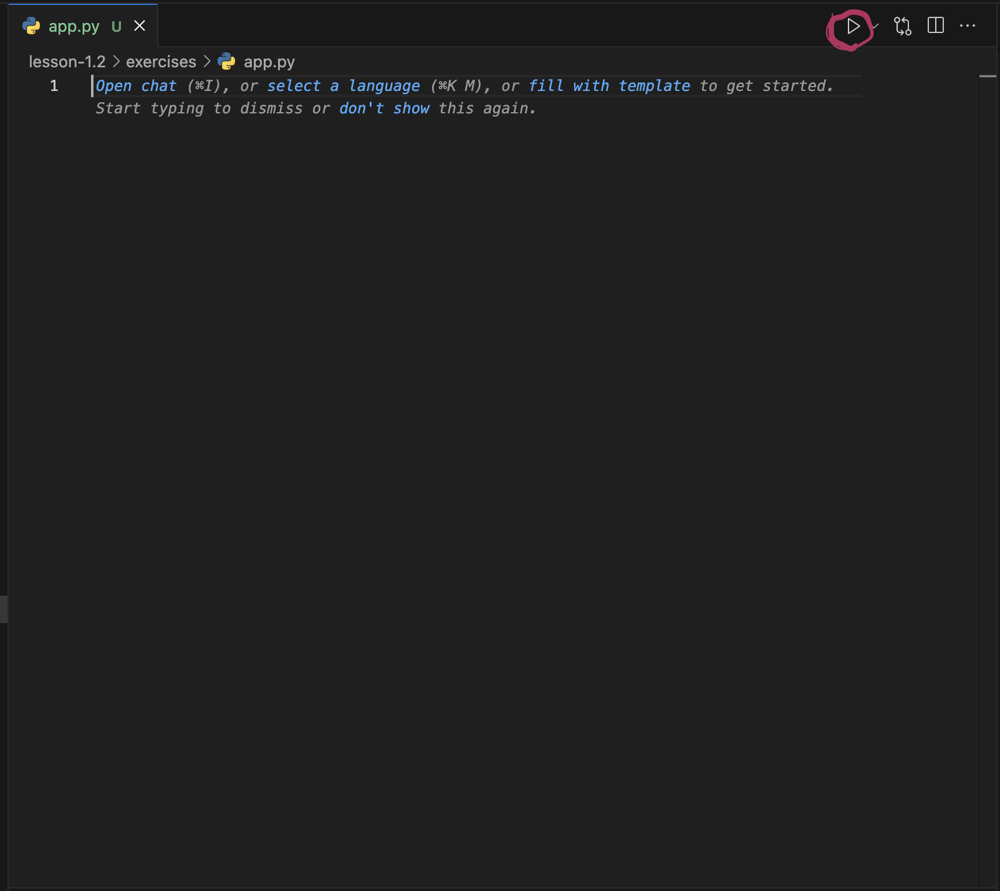

# 🎮 Week 2, Lesson 2: Build Your First Pygame Project with GitHub Copilot

## Welcome to your first video game!

You're about to dive into Pygame the Python toolkit that turns your ideas into playable games with graphics, sounds, and all the fun stuff that makes games amazing. This lesson will guide you step-by-step to create something you can actually play and share.

## 🎯 What You'll Do

[Build a minigame with GitHub Copilot and Python](https://learn.microsoft.com/en-us/training/modules/challenge-project-create-mini-game-with-copilot/?sharingId=F67AE3DA365A6582)

## 🎮 Try building another game

Choose one of these fun text-based games to build with GitHub Copilot:

- **� Number Guessing Game** - The computer picks a random number and you try to guess it with hints like "too high" or "too low"
- **🪨 Rock Paper Scissors** - Classic game where you compete against the computer in best-of-three rounds
- **� Word Guessing Game** - Try to guess a secret word letter by letter (like Hangman but friendlier!)
- **🧮 Math Quiz Game** - Answer random math problems and track your score
- **🗺️ Text Adventure** - Navigate through a story where your choices determine the outcome
- **🎯 Trivia Quiz** - Answer questions from different categories and see how smart you are
- **🔤 Anagram Game** - Unscramble letters to find the hidden word
- **💰 Simple Casino** - Play games like coin flip or dice roll with virtual money

### Getting Started Prompts:
1. "Create a [game name] in Python with user input and game logic"
2. "Add a scoring system and game replay option"
3. "Make the game more interesting with multiple rounds or difficulty levels"

> **💡 Pro Tip:** Don't rush! After each prompt, run your game and see what happens. This is the best way to learn and catch any issues early.

## How to run your game

### Commit & Push Your Game in the Editor
1. Open the Source Control panel in VS Code. You should see your changes listed and an empty message box
2. Type something like: "First version of my Pygame project" (or use copilot).
3. Click the Commit button and confirm you see your message in the window.
4. Click "Sync".
5. Verify your code made it to the repository.